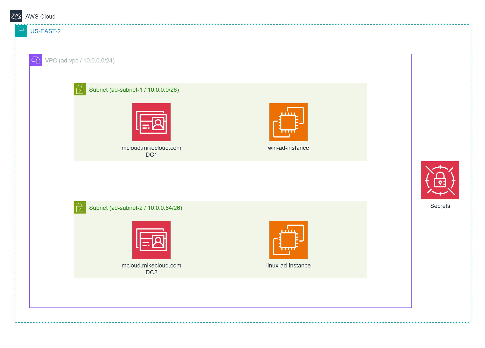
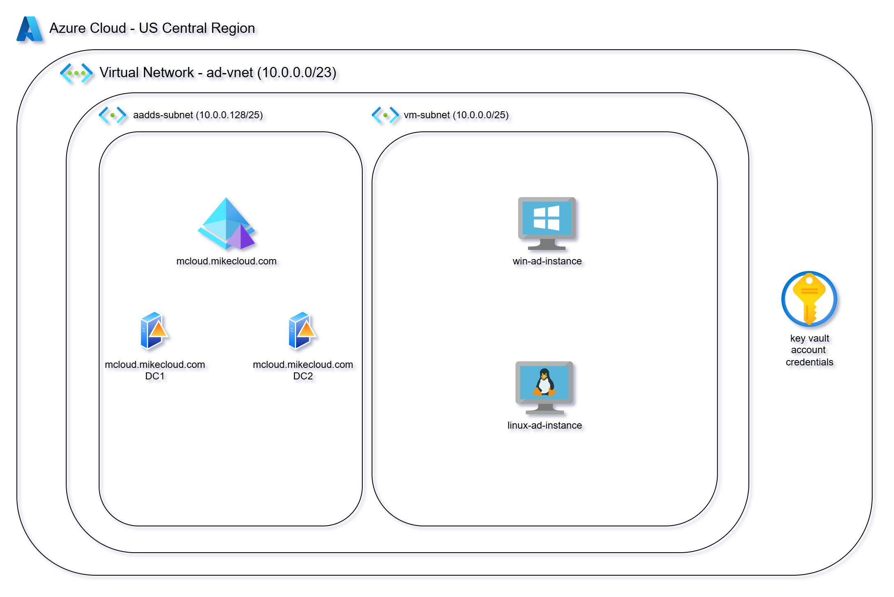
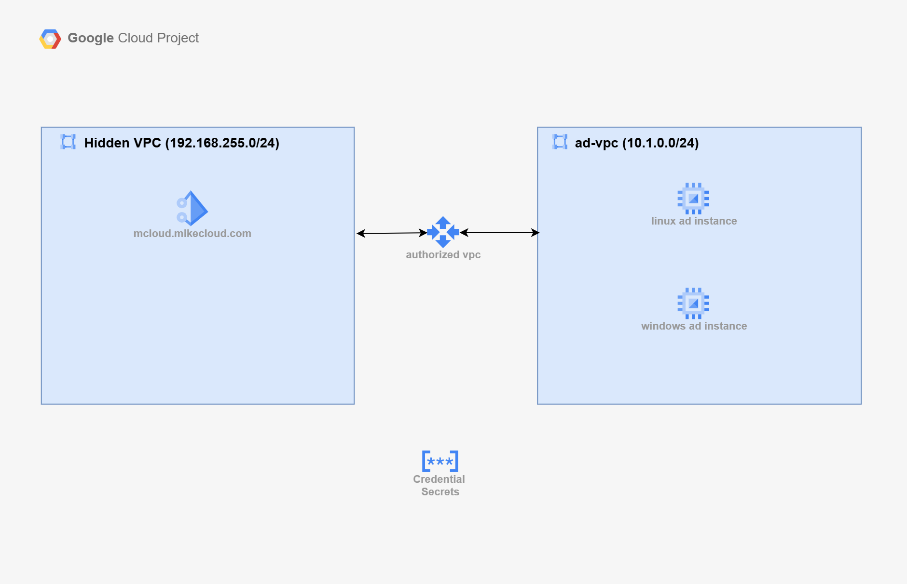
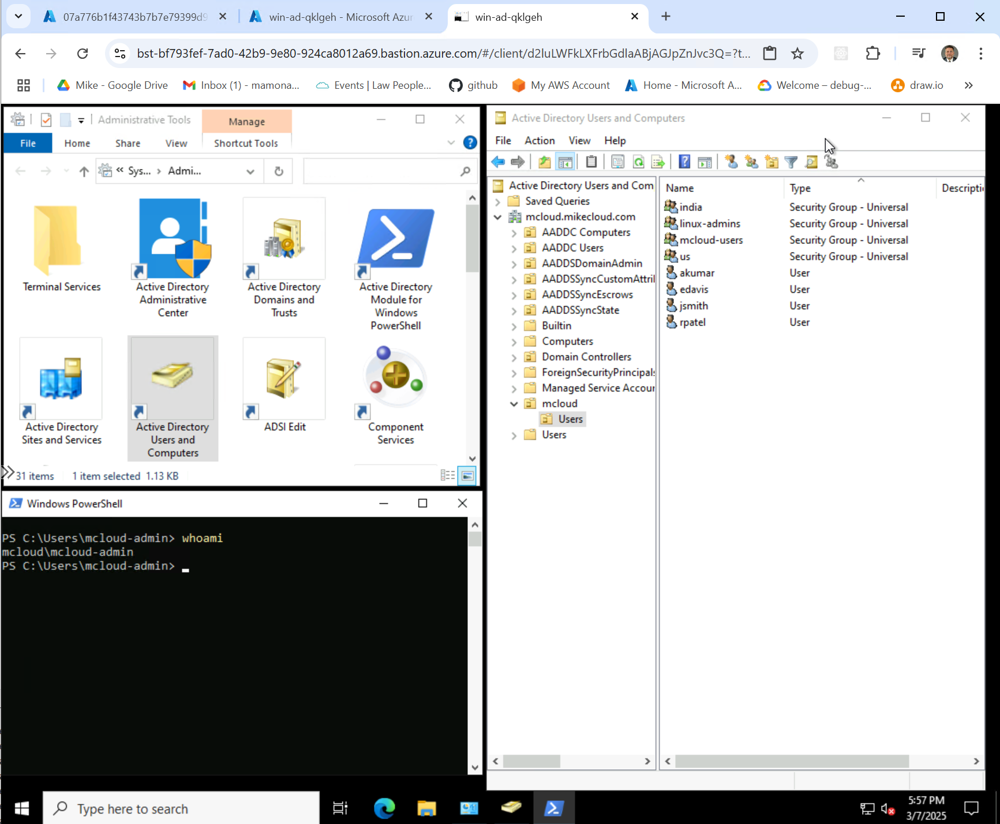
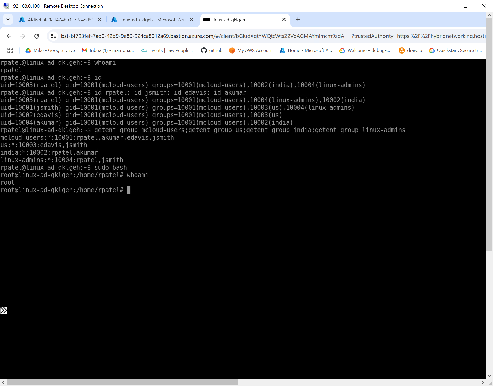

# Deploying Active Directory in the Cloud

In this new series, we’ll deploy **Active Directory** across the three major cloud platforms: **AWS**, **Azure**, and **Google Cloud**. You’ll gain hands-on experience with:

- Setting up **cloud-managed Active Directory**:
   - **AWS Managed Microsoft AD** in AWS
   - **Entra Domain Services** `(aka ADDS)` in Azure
   - **Google Managed Microsoft AD** in Google Cloud
- Configuring secure networking (VPCs, VNets, and subnets) to support domain connectivity.
- Joining both **Linux** and **Windows** servers to the AD domain.
- Configuring **SSSD** ([System Security Services Daemon](https://sssd.io/)) to authenticate Active Directory users on Linux.
- Managing domain-joined servers, including creating Organizational Units (OUs), and managing users and groups.
- Storing **administrator credentials** securely using the appropriate secrets management service:
   - **AWS Secrets Manager** in AWS
   - **Azure Key Vault** in Azure
   - **Google Secret Manager** in Google Cloud
- Comparing pricing, capabilities, and limitations across cloud providers.
- Using **Terraform** and **shell scripts** to fully automate the deployment process across all three clouds — from provisioning the directory service to joining servers and configuring credentials.

This series focuses on **PaaS (Platform-as-a-Service)** offerings for Active Directory, helping you master **Cloud-Hosted Active Directory** without the need to manage domain controllers yourself.

## Quick Links

1. [Deploying Active Directory in the Cloud](TBD)
2. AWS Solution
   - [AWS Directory Service](TBD)
   - [GitHub Project](https://github.com/mamonaco1973/aws-directory/)
3. Azure Solution
   - [Azure Entra Domain Services](TBD)
   - [GitHub Project](https://github.com/mamonaco1973/azure-directory/)
4. GCP Solution
   - [GCP Managed Active Directory]()
   - [GitHub Project](https://github.com/mamonaco1973/gcp-directory/)

## Comparing Managed Active Directory Services: Azure, AWS, and GCP

All three major cloud platforms — **Azure**, **AWS**, and **GCP** — offer **Managed Active Directory** services that fall under **Platform-as-a-Service (PaaS)**.

## What makes these services PaaS?

In each case, the **cloud provider manages the underlying domain controller infrastructure**, including:

- **Provisioning** of domain controllers.
- **Replication and Availability** within a region.
- **Operating System Patching**.
- **Backup and Recovery**.
- **Monitoring and Diagnostics** for core AD health.

You, as the customer, retain control over **directory objects and policies**, including:

- **User and Group Management**.
- **Organizational Unit (OU) Structure**.
- **Group Policy Objects (GPOs)**.
- **Computer Accounts** for domain-joined VMs.

This **division of responsibility** — provider handles the platform, customer handles the directory content — is what defines these services as **PaaS**.

---

## Feature Comparison: Managed Active Directory Services

| **Feature**                            | **AWS Managed Microsoft AD**         | **Microsoft Entra Domain Services**  | **Google Managed Microsoft AD**     |
|----------------------------------------|--------------------------------------|-------------------------------------|------------------------------------|
| **Service Type**                      | Fully managed Windows AD            | Fully managed Windows AD            | Fully managed Windows AD           |
| **Backup Management**                  | Automatic by AWS                     | Automatic by Microsoft               | Automatic by Google                |
| **Patching**                          | Managed by AWS                       | Managed by Microsoft                 | Managed by Google                  |
| **Monitoring**                        | AWS CloudWatch                       | Azure Monitor                       | Cloud Monitoring                   |
| **Domain Join Support**               | Windows & Linux                      | Windows & Linux                      | Windows & Linux                    |
| **Security Group/Firewall Config**     | Controlled via VPC Security Groups   | Controlled via NSGs in VNet          | Controlled via VPC Firewall Rules  |
| **Multi-Zone Redundancy**              | Yes                                 | Yes                                 | Yes                                |
| **Directory Size Options**            | Scale by adding domain controllers   | Standard or Enterprise tier         | Scale by adding domain controllers |
| **Pricing Model**                     | Per-hour based on DC count & size    | Fixed monthly cost                   | Per-hour based on DC count & size  |
| **Management Tools**                  | Standard AD Tools (ADUC, GPMC, PowerShell) | Standard AD Tools (ADUC, GPMC, PowerShell) | Standard AD Tools (ADUC, GPMC, PowerShell) |

---

## AWS Active Directory Solution Summary

### Service Used
**AWS Managed Microsoft AD** provides a fully managed Active Directory service within your **VPC**, allowing you to run directory-aware workloads without having to deploy and manage your own domain controllers.

### Key Components
- **VPC and Subnets:** AD deployed across multiple Availability Zones for redundancy.
- **Security Groups:** Configured to allow essential domain traffic (DNS, LDAP, Kerberos, etc.).
- **Domain Controllers:** Fully managed by AWS, with automatic patching, backups, and monitoring.
- **EC2 Instances:** Both **Linux** and **Windows** servers can be joined to the domain.
- **Secrets Management:** Credentials are stored securely in **AWS Secrets Manager** for automation and secure retrieval.

### Retrieving Initial Admin Credentials

Once **AWS Managed Microsoft AD** is provisioned, AWS automatically creates the **`Admin`** user account within the directory. This account has **Domain Admin** privileges, allowing you to perform administrative tasks like creating Organizational Units (OUs), managing Group Policy, and adding users. You can set the Admin password directly in the console and directly in the terraform. In this project we store the **`Admin`** credentials in the `admin_ad_credentials` secret.

### Key Advantages
- Deep integration with other AWS services (e.g., EC2, RDS, FSx).
- Full control over directory objects and policies.
- Scalable by adding additional domain controllers as needed.
- Flexible network design within your VPC.

### Use Cases
- Migrating on-premises AD workloads to AWS.
- Extending on-premises AD to the cloud for hybrid scenarios.
- Supporting Windows and Linux workloads that require domain authentication.

## Azure Active Directory Solution Summary

### Service Used
**Microsoft Entra Domain Services** (formerly known as **Azure Active Directory Domain Services**) provides a **fully managed Active Directory service** within your **VNet**, allowing you to run directory-aware workloads without having to deploy and manage your own domain controllers.

### Key Components
- **VNet and Subnets:** Entra Domain Services is deployed into a dedicated **subnet** within a **VNet**.
- **Network Security Groups (NSGs):** Configured to allow essential domain traffic (DNS, LDAP over TLS, Kerberos, etc.).
- **Domain Controllers:** Fully managed by Microsoft — patching, replication, backups, and monitoring are all handled automatically.
- **Azure VMs:** Both **Linux** and **Windows** servers can be joined to the domain.
- **Secrets Management:** Credentials are stored securely in **Azure Key Vault** for automation and secure retrieval.

### Retrieving Initial Admin Credentials

After **Microsoft Entra Domain Services** is provisioned, **administrative access to the managed domain** works differently compared to traditional Active Directory.

Microsoft Entra Domain Services does not automatically create an initial administrator user. Instead, the process works as follows:

1. **Create a group named `AAD DC Administrators`** within your **Microsoft Entra ID** (formerly Azure AD) tenant. This group grants its members administrative permissions within the managed domain.
2. **Create a user account** in Entra ID (this will act as the domain admin account for the managed domain).
3. **Add the user account to the `AAD DC Administrators` group**.
4. **Wait for directory synchronization to complete** (this can take up to 30 minutes). After synchronization, the user will have administrative rights inside the managed domain.

In this solution, we **automate all these steps** using **Terraform and Azure CLI scripts**. The **admin credentials** for the newly created user are securely stored in **Azure Key Vault** as a secret named `admin_ad_credentials`. This allows other automation steps — such as joining servers to the domain — to retrieve the credentials securely.

### Key Advantages
- Tight integration with **Microsoft Entra ID** (formerly Azure AD) for seamless identity management.
- No need to manage underlying domain controller infrastructure.
- Fixed pricing simplifies cost management.
- Built-in high availability across **two domain controllers** deployed automatically.

### Use Cases
- Enabling legacy **Windows Authentication** for Azure-based applications.
- Extending cloud identity to support **Kerberos** and **LDAP** applications.
- Migrating on-premises directory-aware workloads to **Azure VMs**.
- Hybrid scenarios where **Entra ID** is the identity provider but some applications still require **traditional Active Directory**.

## GCP Active Directory Solution Summary

### Service Used
**Google Managed Microsoft AD** provides a fully managed Active Directory service within your **VPC**, allowing you to run directory-aware workloads without having to deploy and manage your own domain controllers.

### Key Components
- **VPC and Subnets:** AD deployed across multiple subnets within a **single region**.
- **Firewall Rules:** Configured to allow essential domain traffic (DNS, LDAP, Kerberos, etc.).
- **Domain Controllers:** Fully managed by Google, with automatic patching, backups, and monitoring.
- **Compute Engine Instances:** Both **Linux** and **Windows** servers can be joined to the domain.
- **Secrets Management:** Credentials are stored securely in **Google Secret Manager** for automation and secure retrieval.

\

### Retrieving Initial Admin Credentials

Once **Google Managed Microsoft AD** is provisioned, Google automatically creates the **`setupadmin`** account within the directory. This account has **Domain Admin** privileges, allowing you to perform administrative tasks like creating Organizational Units (OUs), managing Group Policy, and adding users.  

The initial password for the `setupadmin` account can be retrieved directly via **gcloud CLI** (`gcloud active-directory domains reset-admin-password "mcloud.mikecloud.com"`) or the **Google Cloud Console**.  

In this project, we automate this by storing the **`setupadmin`** credentials in **Google Secret Manager** using a secret named `admin_ad_credentials`.

This allows Terraform and shell scripts to dynamically retrieve credentials for subsequent automation steps, such as joining servers to the domain.

### Key Advantages
- Flexible scaling by adding domain controllers to meet performance needs.
- Works seamlessly with other Google Cloud services (e.g., Compute Engine, Filestore).

### Use Cases
- Migrating on-premises AD workloads to Google Cloud.
- Extending on-premises AD to the cloud for hybrid scenarios.
- Supporting both **Linux** and **Windows** workloads that require domain authentication.
- Running directory-aware applications directly on GCP without managing domain controllers.

## Active Directory Overview

As part of this project, when the Windows instance boots and successfully joins Active Directory, a set of **users** and **groups** are automatically created through a scripted process. These resources are intended for **testing and demonstration purposes**, showcasing how to automate user and group provisioning in a cloud-integrated Active Directory environment.

### Groups Created

| Group Name    | Group Category | Group Scope | gidNumber |
|----------------|----------------|----------------|------------|
| mcloud-users   | Security       | Universal     | 10001 |
| india          | Security       | Universal     | 10002 |
| us             | Security       | Universal     | 10003 |
| linux-admins   | Security       | Universal     | 10004 |

### Users Created and Group Memberships

| Username | Full Name   | uidNumber | gidNumber | Groups Joined                    |
|---------|------------|-----------|-----------|----------------------|
| jsmith  | John Smith  | 10001 | 10001 | mcloud-users, us, linux-admins |
| edavis  | Emily Davis | 10002 | 10001 | mcloud-users, us |
| rpatel  | Raj Patel   | 10003 | 10001 | mcloud-users, india, linux-admins |
| akumar  | Amit Kumar  | 10004 | 10001 | mcloud-users, india |

---

### Understanding `uidNumber` and `gidNumber` for Linux Integration

The **`uidNumber`** (User ID) and **`gidNumber`** (Group ID) attributes are critical when integrating **Active Directory** with **Linux systems**, particularly in environments where **SSSD** ([System Security Services Daemon](https://sssd.io/)) or similar services are used for identity management. These attributes allow Linux hosts to recognize and map Active Directory users and groups into the **POSIX** (Portable Operating System Interface) user and group model.

### Why It Matters
- **Linux Compatibility:** Linux expects every user and group to have a numeric ID (`uid`/`gid`). Active Directory, by default, does not assign these automatically. Setting `uidNumber` and `gidNumber` ensures Linux systems can properly identify users and groups when performing operations like file ownership, process ownership, and permissions enforcement.
- **NFS & File Shares:** When using shared storage such as **NFS**, these numeric IDs are essential for consistent **file permissions** across platforms (Windows, Linux, macOS).
- **Cross-Platform Identity:** With these attributes set, users can **log into both Windows and Linux servers** using the same Active Directory credentials, maintaining a unified **identity** across heterogeneous environments.
- **POSIX Compliance (RFC 2307):** This approach aligns with **RFC 2307**, which defines how UNIX attributes like `uidNumber`, `gidNumber`, `homeDirectory`, and `loginShell` can be stored within **LDAP directories** such as Active Directory. This RFC is the foundation for making AD a viable **POSIX-compliant identity provider** for Linux and UNIX systems.

By explicitly assigning `uidNumber` and `gidNumber`, this project ensures that Active Directory users and groups are not only available to **Windows** systems but are also **ready for immediate Linux integration**, reducing manual mapping efforts and ensuring consistent identity handling across the **hybrid infrastructure**.

### Reference
- RFC 2307: **An Approach for Using LDAP as a Network Information Service**  
  [https://datatracker.ietf.org/doc/html/rfc2307](https://datatracker.ietf.org/doc/html/rfc2307)

---

This is especially important in cloud projects where **Windows and Linux servers co-exist**, and **centralized identity management** across both platforms is a requirement.

## Quick Demo

### Windows Instance

In addition to creating the **project users and groups**, the Windows instance’s boot script also installs the **Active Directory management tools** under `Administrative Tools`. These tools include:

- **Active Directory Users and Computers (ADUC)**  
- **Active Directory Administrative Center**  
- **Active Directory PowerShell Module**

These tools allow administrators to easily **view, manage, and troubleshoot** the users, groups, and directory settings directly from the Windows server itself. This is particularly useful for environments where **hybrid identity management** is required, supporting both **Windows and Linux clients**.

---

### Linux Instance

The Linux instance is configured to allow **password-based SSH access** using the **Active Directory accounts** created during the setup. This ensures that users can log in using the same credentials they would use for Windows systems, supporting **single identity across platforms**.

#### Group-Based Privileges
- **Standard Users:** All users can log in via SSH and perform regular operations.
- **Administrators:** Users who are members of the `linux-admins` group automatically receive **`sudo` privileges**, allowing them to perform administrative tasks on the Linux server.

This setup ensures that **administrative access** is restricted to only authorized users, while standard users have **limited access**, aligning with common **role-based access control (RBAC)** best practices.

---

This cross-platform authentication, combined with `uidNumber` and `gidNumber` attributes (following **RFC 2307**), makes the Active Directory environment fully compatible with **Linux-based systems**, ensuring seamless integration in **hybrid cloud environments**.

